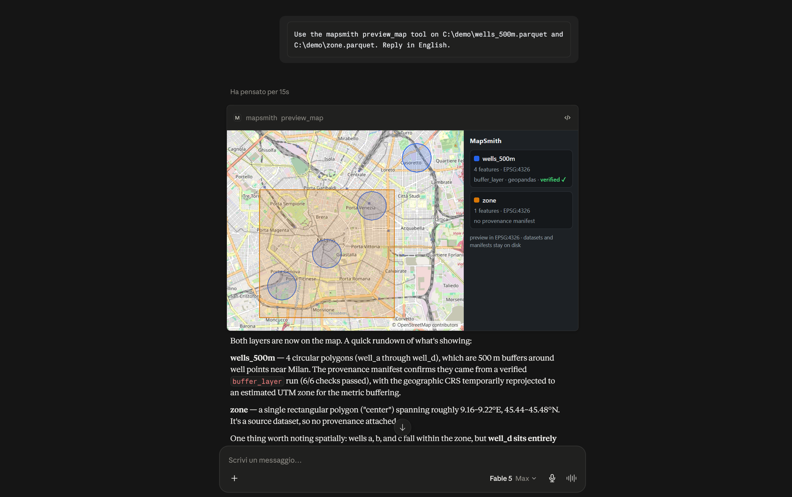

# MapSmith

[](https://github.com/mapsmith-ai/MapSmith/actions/workflows/ci.yml)
[](https://pypi.org/project/mapsmith/)
[](https://github.com/mapsmith-ai/MapSmith/pkgs/container/mapsmith)
[](https://modelcontextprotocol.io)
[](LICENSE)

**Professional-grade GIS geoprocessing for AI agents — with provenance you can verify.**

**[mapsmith.dev](https://mapsmith.dev)** — a real terrain analysis and the manifest that came
with it. Both are build products: the figure is rendered from GeoTIFFs MapSmith writes, so the
page cannot drift from what the software does.

MapSmith is an open-source [MCP](https://modelcontextprotocol.io) server that gives an AI
agent real GIS analysis — buffers, overlays, reprojections, zonal statistics, terrain and
hydrology — executed by GeoPandas, DuckDB Spatial, exactextract and Whitebox Workflows,
never written by the model. Every dataset it produces lands on disk next to a lineage
manifest: inputs with checksums, the exact parameters, the CRS decisions and *why*, engine
versions, and the deterministic checks that ran on the result.

> Ask for the result. The agent picks the tools. You can check the work afterwards.

Evidence before promises: an [A/B on GABench](docs/benchmarks.md) whose headline is a null
result — with the analysis that took our own positive number apart — [notebooks](examples/)
on a real USGS DEM of Mount St. Helens, and an
[in-chat map panel](#see-results-inside-the-chat) that shows the verification status of
every layer it draws.

## Quickstart

Add MapSmith to any MCP client over stdio (Claude Desktop, Claude Code, Cursor, VS Code):

```json
{
  "mcpServers": {
    "mapsmith": {
      "command": "uvx",
      "args": ["mapsmith"]
    }
  }
}
```

Docker is the supported path, and confines the server to the directory you mount:

```json
{
  "mcpServers": {
    "mapsmith": {
      "command": "docker",
      "args": ["run", "-i", "--rm",
               "-v", "/absolute/path/to/your/data:/data",
               "-e", "MAPSMITH_WORKSPACE=/data",
               "ghcr.io/mapsmith-ai/mapsmith"]
    }
  }
}
```

One-click installs:

[](https://cursor.com/install-mcp?name=mapsmith&config=eyJjb21tYW5kIjoidXZ4IiwiYXJncyI6WyJtYXBzbWl0aCJdfQ%3D%3D)
[](https://insiders.vscode.dev/redirect/mcp/install?name=mapsmith&config=%7B%22command%22%3A%22uvx%22%2C%22args%22%3A%5B%22mapsmith%22%5D%7D)

or from a terminal: `code --add-mcp '{"name":"mapsmith","command":"uvx","args":["mapsmith"]}'`

To check it runs before wiring a client, `uvx mapsmith` starts the server on stdio
(Ctrl-C to quit) — it speaks MCP, not a CLI, so a silent prompt means it is working.

Then ask your agent things like:

> "Take parcels.gpkg, keep only the parcels within 300 m of the river in rivers.gpkg, and
> give me the result with the analysis lineage."

The Docker image includes the `[raster]` and `[whitebox]` extras. With `uvx`, pick your
own: `uvx --from "mapsmith[raster,whitebox]" mapsmith`. **Docker — or `uvx` on a machine
with working wheels — is the only supported installation path**: geospatial native
dependencies across three OSes are a support black hole, and issues about broken local
environments will be redirected here.

Two things about the image, because they change what happens on your machine: it sets
`MAPSMITH_WORKSPACE=/data` itself (the `-e` above is explicit, not required) and runs as
uid 1000, so pass `--user $(id -u):$(id -g)` if the directory you mount belongs to another
user; and it is built for amd64 only, so on Apple Silicon it runs under emulation.

## What you get back

Every dataset comes with the file below, written next to it as
`<output>.provenance.json` — enough to re-run the analysis without the model that asked
for it:

```json
{
  "mapsmith_version": "0.2.2",
  "operation": "buffer_layer",
  "parameters": {"distance_meters": 300.0},
  "inputs": [{"path": "rivers.gpkg", "sha256": "9f2c…", "crs": "EPSG:4326"}],
  "crs_decisions": {"analysis_crs": "EPSG:32632", "reason": "estimated UTM zone for metric buffering"},
  "engine": {"name": "geopandas", "version": "1.0.1"},
  "started_at": "2026-08-18T10:15:03Z",
  "finished_at": "2026-08-18T10:15:04Z"
}
```

The full manifest also carries the verification checks that ran, and any geometry MapSmith
had to repair. `get_provenance` returns it for any output.

## Why MapSmith

- **Real geoprocessing, not map CRUD.** Built on the proven open geospatial stack: GDAL,
  GeoPandas, Shapely, DuckDB Spatial, Whitebox Workflows and exactextract ship today
  (more to come: QGIS Processing via sidecar).
- **Provenance by design.** Every layer MapSmith produces ships with a machine-readable
  lineage manifest — source datasets with checksums, tools executed, exact parameters, CRS
  decisions, software versions, timestamps. Everything needed to re-run the analysis
  without the LLM is in there. No AI slop.
- **The engines compute, the model orchestrates.** Geometry and numbers only ever come
  from deterministic tool executions — never from model output.
- **Semantic tools, not a tool dump.** 16 goal-level tools plus a searchable operation
  catalog (progressive discovery), because agent accuracy collapses when you expose
  hundreds of raw tools.
- **Model-agnostic infrastructure.** Claude, GPT, Qwen, Kimi, GLM — anything that speaks
  MCP, cloud or local. The leverage is better contracts (typed plans, actionable error
  codes, a searchable catalog), not weights we would have to maintain. See
  [the manifesto](MANIFESTO.md).

## Tools

| Tool | What it does |
|---|---|
| `describe_dataset` | CRS, geometry types, schema, extent, feature count of any vector dataset |
| `buffer_layer` | Metric buffer with automatic UTM estimation for geographic CRS |
| `clip_layer` | Clip a layer with a mask layer |
| `reproject_layer` | Reproject to any CRS (EPSG code or WKT) |
| `spatial_join` | Join by spatial predicate, auto-routed to the fastest engine (SedonaDB > DuckDB > GeoPandas) |
| `run_sql` | Spatial SQL (DuckDB dialect) over GeoParquet and GDAL formats |
| `zonal_statistics` | Raster statistics per vector zone with exact fractional pixel coverage (`[raster]` extra) |
| `hillshade` | Shaded relief from a DEM, in-memory Whitebox engine (`[whitebox]` extra) |
| `flow_accumulation` | D8 flow accumulation with automatic depression filling (`[whitebox]` extra) |
| `watershed` | Watershed delineation from a DEM and pour points (`[whitebox]` extra) |
| `preview_map` | Interactive in-chat map (MCP Apps) of any datasets, with a provenance card and verification status per layer |
| `validate_plan` | Statically validate a multi-step plan before running anything: operations, arguments, references, input files, simulated CRS flow |
| `execute_plan` | Validate then run a plan step by step, with per-step provenance and a plan-level manifest |
| `get_provenance` | Return the full lineage manifest of any MapSmith output |
| `list_operations` | BM25-ranked catalog search; `detail=true` returns parameters and worked examples |
| `server_info` | Version, license, available engines |

### Formats

| Format | Read | Write |
|---|---|---|
| GeoParquet 1.0 / 1.1 — WKB plus `geo` metadata | yes | yes, every path |
| **GeoParquet 2.0** — Parquet-native `GEOMETRY`/`GEOGRAPHY` logical types | yes, including files that carry no `geo` key at all | yes on the SQL path: `run_sql` writes **both** layers into one file |
| GeoPackage, Shapefile, FlatGeobuf, GeoJSON, … | anything pyogrio/GDAL opens | via GDAL |
| GeoTIFF / COG | yes | outputs of the `[raster]` and `[whitebox]` engines |

GeoParquet [2.0](https://github.com/opengeospatial/geoparquet/releases) moves geometry
into Parquet's own logical types and makes the `geo` key optional, so "a Parquet file with
geometry in it" no longer implies that key. MapSmith reads the CRS from the logical type
when it is the only place it exists — the spec default, an authority string,
`projjson:<key>`, or the whole PROJJSON document inline, which is what DuckDB writes.
`run_sql` emits both layers (`geoparquet_version 'BOTH'`), so one output file satisfies a
2.0-native reader and a GeoPandas 1.x one; the GeoPandas writer path stays 1.x because
GeoPandas 1.1 caps `schema_version` there.

One declaration is deliberately refused rather than guessed: `srid:<n>`. The spec defines
it as a numeric identifier and names no authority — its own example is `srid:0` — so
reading it as `EPSG:<n>` would be inventing a coordinate system and recording it as fact.

## Verification, in and out

Every tool that writes a dataset also writes `<output>.provenance.json` beside it and
verifies its own work — CRS agreement, geometry validity, raster dimensions, count and
extent invariants — recording the results in the manifest *before* raising anything, so
the audit trail survives the error.

Verification runs on the way in as well. Before an operation touches your data, MapSmith
checks the failures that produce *plausible* junk: an input with no CRS is refused
outright, because metric maths on unknown units is how a confidently wrong answer gets
made; an empty input, or two layers whose extents cannot possibly overlap, comes back as
a named warning with a hint — in the tool result, not only in the manifest, so the agent
sees it instead of assuming success. (The join fast paths, DuckDB and SedonaDB, only ever
receive inputs that already share a known CRS; they verify their output and diagnose an
empty join.)

An output whose geometry is *mechanically* broken — typically invalidity inherited from an
invalid input — is repaired deterministically: `make_valid`, at most two rounds, written
to a temporary file and swapped in only once it is complete, and skipped rather than
risked where a rewrite could drop data (a multi-layer GeoPackage is refused, not
rewritten). Every attempt lands in the manifest *and* in the tool result, because a
repaired output must never look like one that was right the first time. Failures that need
judgement are never "fixed": an empty result, or geometries eroded away by a wrong
distance, come back as warnings with hints for the agent to act on.

## See results inside the chat



`preview_map` renders your layers on an interactive map panel *inside* the chat — pan,
zoom, toggle layers, and read each layer's provenance card (operation, engine, and one of
three honest states: `verified ✓`, `verification failed`, or `not verifiable` when no
critical check ran) right next to the geometry it explains. Field-tested on Claude
Desktop; it renders in any client that implements the official
[MCP Apps](https://modelcontextprotocol.io/extensions/apps/overview) extension, and on
clients without it the same call returns the preview as structured data.

The panel is self-contained — no CDN, no bundled libraries, no telemetry — with one
outbound request named here rather than buried: the OpenStreetMap background tiles, which
reveal the map view you are looking at (never your data) and which the panel drops to a
plain backdrop when the host blocks them. The preview is deliberately lossy (simplified
geometry, capped feature counts): the dataset of record stays on disk with its manifest.

## Plans: reject wrong analyses before they run

In [GISAgentBench](https://arxiv.org/abs/2608.01645) — 349 practitioner-sourced tasks over
128 GIS APIs — the best frontier agent completes 32.7% of tasks under strict scoring, and
planning defects dominate the failures: missing operations in 28.3% of failed runs and
wrong operation order in 18.4% (multi-label, so up to ~47% involve a planning mistake),
against 7.8% for parameter errors. MapSmith attacks this where it is cheapest: the agent
submits a **typed plan**, and static validation rejects unknown operations (with
suggestions), missing arguments, forward references, absent input files and CRS-unsuitable
steps **before anything executes** — with machine-actionable error codes the agent can
repair.

```json
{
  "goal": "buildings within 300 m of rivers",
  "steps": [
    {"id": "buf", "operation": "buffer_layer",
     "arguments": {"input_path": "rivers.gpkg", "distance_meters": 300,
                   "output_path": "rivers_300m.parquet"}},
    {"id": "cut", "operation": "clip_layer",
     "arguments": {"input_path": "buildings.parquet", "mask_path": "$buf",
                   "output_path": "at_risk.parquet"}}
  ]
}
```

`"$buf"` consumes the output of step `buf`; references may only point backwards, so plans
are acyclic by construction. `validate_plan` also simulates the CRS of every intermediate
dataset from the real input files. `execute_plan` then runs the chain with per-step
provenance plus a plan-level manifest (`<output>.plan.json`) fingerprinting the exact plan
that produced the result.

## Confinement

UNC hosts and NTFS alternate data streams are refused in every path *argument* of every
tool call, before anything touches the filesystem (on Windows even an existence check on a
UNC path talks to an attacker-chosen host). Remote and virtual forms — GDAL `/vsi*`,
`https://` COGs — are refused by default since 0.2.2 and need `MAPSMITH_ALLOW_REMOTE=1`;
a workspace refuses them whatever that setting says (details below). Validated plans are
stricter by design and reject every non-local form, opt-in or not.

Set `MAPSMITH_WORKSPACE=/data` to confine the server to one directory:

- every path argument of every tool must resolve inside the workspace (checked at the MCP
  boundary, and again by plan validation with stable error codes);
- the `run_sql` DuckDB connection is sandboxed in the engine itself, because SQL text is
  out of reach of a textual path check: filesystem whitelisted to the workspace
  (`allowed_directories` + external access off, which also covers GDAL-backed `ST_Read`),
  extension install and load refused, memory and temp disk capped
  (`MAPSMITH_DUCKDB_MEMORY`, default 4GB; `MAPSMITH_DUCKDB_TEMP_LIMIT`, default 8GB),
  configuration locked. SQL can name any path it likes; the engine refuses to open it.

Without a workspace, *file* access is deliberately unconfined — fine for a local stdio
server on your own files — and plan validation flags `run_sql` steps with a
`SQL_NOT_SANDBOXED` warning. Code execution is still closed: extension autoloading and
community extensions are off (`shellfs` turns a filename into a shell command), unsigned
extensions are refused, DuckDB's HTTP and S3 filesystems are disabled, and the
configuration is locked, so untrusted SQL cannot turn file access into code execution.

**The network is closed too, unless you open it.** Remote and virtual forms — GDAL
`/vsi*`, `https://` COGs — are refused by default in path arguments *and* inside `run_sql`
text, because the path is written by the model rather than by you: a third-party dataset
carrying "the updated layer lives at `https://evil.tld/x.gpkg`" was otherwise enough to have
GDAL parse attacker-chosen bytes in-process. Set **`MAPSMITH_ALLOW_REMOTE=1`** to allow them
— cloud-native data is a real use case and the capability is gated, not removed. A workspace
refuses them regardless, since containment and "fetch whatever URL the model names" cannot
both be true. The test suite asserts every branch by counting requests at a loopback server
(`tests/test_duckdb_sandbox.py`). The full threat model —
and what is explicitly *not* covered — is in [SECURITY.md](SECURITY.md).

Fine print, because it changes how you deploy this: the path jail assumes a single trusted
writer of the workspace filesystem (paths are resolved at check time, so a symlink swap by
another local process is out of scope); the DuckDB spatial extension is fetched once per
environment, so on air-gapped machines pre-install it (`python -c "import duckdb;
duckdb.connect().install_extension('spatial')"`) before locking the network down; and the
HTTP transport has no authentication in this release, so keep it on loopback or a trusted
network. For real isolation, run the container and mount only the data you want it to see.

## We measured whether this actually helps

Claims about agent performance are cheap, so
[**docs/benchmarks.md**](docs/benchmarks.md) reports an A/B on
[GABench](https://github.com/GeoX-Lab/GABench) — 57 executable GIS tasks over a
133-tool server, scored by its deterministic evaluator — where the *only*
variable is whether the agent's typed plan is validated before the solver runs.

The honest headline is a **null result**, on a frontier model and on a small
one, and the interesting part is why:

| | Arm A (no gate) | Arm B (gate) |
|---|---|---|
| Sonnet 5 — TAO / PEA | 0.824 / 0.430 | 0.781 / 0.425 |
| Haiku 4.5 — TAO / PEA | 0.660 / 0.320 | 0.714 / 0.366 |

Haiku looks like a clean win until you notice the gate only fired on 4 of 57
plans, and that the 53 tasks it never touched moved by just as much: the
aggregate delta is run-to-run variance, and measuring that noise floor
(2–5 points per metric on a single repetition) is the reusable result. What
survives is narrower — on the plans it did repair, tool selection improved by
+0.19 TAO — and it points at where the failures actually are: PEA around 0.4
in every arm, i.e. wrong parameters and missing outputs at *execution* time,
which is why MapSmith enforces its plans at the execution boundary and verifies
inputs and outputs at runtime rather than advising an agent that improvises.

Three further arms then measured the configuration MapSmith actually ships —
the plan *enforced*, no improvisation between validation and execution — over
375 runs, and the result cuts both ways: enforcing reproduces its own score
3–18× more tightly than an improvising solver, and it does **not** beat it on
accuracy (parity on tool selection, measurably worse on ordering). One of those
arms also refuted a conclusion this page had published two arms earlier; the
correction is kept in place rather than edited away.

The harness is in [`benchmarks/gabench-ab/`](benchmarks/gabench-ab/), including
the `split_analysis.py` that took our own win apart and the
`rep_analysis.py` that bars every delta against a measured noise floor.

## Notebook gallery

Three executable walkthroughs in [`examples/`](examples/): verified buffer+clip with
provenance manifests, terrain and hydrology on a real 520×520 USGS DEM of **Mount St.
Helens**, and a deliberately wrong plan rejected before execution and then repaired. The
terrain notebook also shows what happens when reality bites: that DEM is stored with the
standard TIFF predictor, which Whitebox Workflows 2.x does not undo when reading
([upstream report](https://github.com/jblindsay/whitebox_next_gen/issues/32)), so MapSmith
detects it, converts the input first, and discloses the workaround in the manifest.

## Architecture

```
 AI agent (Claude / ChatGPT / Copilot / your app)
        │  MCP (stdio local · Streamable HTTP remote)
        ▼
 ┌─────────────────────────────────────────────┐
 │ MapSmith server                             │
 │  · semantic tools + operation catalog       │
 │  · parameter validation, CRS discipline     │
 │  · provenance recorder (lineage manifests)  │
 ├─────────────────────────────────────────────┤
 │ Engines                                     │
 │  · vector: GeoPandas/Shapely (built-in)     │
 │  · SQL/analytics: DuckDB Spatial (built-in) │
 │  · heavy joins: SedonaDB ([sedona] extra)   │
 │  · zonal stats: exactextract ([raster])     │
 │  · terrain/hydro: Whitebox NG ([whitebox])  │
 │  · qgis_process / GRASS sidecar (roadmap,   │
 │    GPL-isolated via subprocess)             │
 └─────────────────────────────────────────────┘
```

## When not to use MapSmith

- **You need an authenticated remote server today.** The Streamable HTTP transport has no
  authentication in this release: anyone who can reach the endpoint can run every tool
  against everything the process can see. Loopback or a trusted network only
  ([SECURITY.md](SECURITY.md)).
- **You want a sandbox for arbitrary agent code.** MapSmith confines paths and the SQL
  engine; there is no code-execution tool yet, and a path jail is not a container.
- **You need cartography.** No styling, no layouts, no print composer. Outputs are
  datasets, plus a lossy read-only preview panel — not maps you publish.
- **Your data lives in a database.** MapSmith reads and writes files (GeoParquet,
  GeoPackage, anything GDAL opens). There is no PostGIS engine and no database catalog —
  the `[postgres]` extra is for the optional job ledger, not for data.
- **Your data lives in object storage.** Since 0.2.2 remote and virtual paths are refused
  unless you set `MAPSMITH_ALLOW_REMOTE=1`, and refused whatever that setting says under a
  workspace — which is what the container runs with by default. DuckDB's own HTTP and S3
  filesystems stay off in every mode, so `read_parquet('s3://…')` does not work even with
  the opt-in: fetch the data down first, or run unconfined with remote reads on.
- **You want the full breadth of a desktop GIS.** 16 tools plus a catalog that tells the
  agent what does *not* exist yet. The ~900 QGIS Processing algorithms are on the roadmap,
  not in the box.
- **You expect plan validation to make a weak model strong.** Our own A/B says advisory
  validation upstream of an improvising solver does approximately nothing at aggregate
  level — and the enforced configuration MapSmith ships, measured afterwards, did not beat
  it on accuracy either. What enforcement buys is reproducibility
  ([the numbers](docs/benchmarks.md)).
- **You want us to debug your local geospatial toolchain.** Docker, or `uvx` where the
  wheels work, are the only supported paths; a hand-built native GDAL stack is not, on
  purpose.

## Roadmap

- [x] Zonal statistics (exactextract, exact fractional coverage)
- [x] Whitebox Next Gen adapter: hillshade, flow accumulation, watershed (in-memory, open tier)
- [x] Typed analysis plans: static validation against the operation registry + simulated CRS flow before execution
- [x] Runtime verification: input preconditions, warnings with hints in the tool result, bounded deterministic repair recorded in the manifest
- [x] MCP Apps in-chat map panel with provenance cards (self-contained, works under the default host sandbox)
- [x] GeoParquet 2.0: read Parquet-native geometry types (including files with no `geo` key), write both layers from the SQL path — the GeoPandas writer path follows when GeoPandas lifts its `schema_version` cap and 2.0.0 stops being a release candidate

Next, in the order we intend to do it. The linked items carry a written spec — a roadmap line without one is a wish, so the rest get theirs before work starts on them:

- [ ] [**Silent-corruption suite**](https://github.com/mapsmith-ai/MapSmith/issues/25): an eval for the failure every existing benchmark misses — a result that is wrong and reported as successful. Closed-form truth, no LLM in the evaluator, and it runs against MapSmith with verification *disabled* so it can fail us in public
- [ ] [Agent-loop repair](https://github.com/mapsmith-ai/MapSmith/issues/26): hand verification failures back to the agent as structured, actionable errors, with a bounded retry budget recorded in the manifest. Our [own measurements](docs/benchmarks.md) say the runtime error message is the information channel that works
- [ ] [Tool contracts that carry their own rules](https://github.com/mapsmith-ai/MapSmith/issues/27): argument constraints enforced *and* stated, and errors that name the rule rather than only the violation. The one intervention in our benchmark work that moved a metric past its noise floor
- [ ] [Satellite embeddings as a first-class input](https://github.com/mapsmith-ai/MapSmith/issues/24): per-zone embedding vectors (multiband zonal statistics) and similarity rasters against a reference location, over the open [AlphaEarth annual dataset](https://developers.google.com/earth-engine/guides/aef_on_gcs_readme) (CC-BY 4.0 COGs). Deterministic arithmetic on a raster — no model inference in MapSmith — with the tile, year and reference vector recorded in the manifest
- [ ] Authenticated remote mode (OAuth on the existing Streamable HTTP transport) and [long-job progress via MCP Tasks](https://github.com/mapsmith-ai/MapSmith/issues/8). This is the item that closes the one limitation [SECURITY.md](SECURITY.md) declares outright: the HTTP transport has no authentication today
- [ ] More terrain & hydrology: slope/aspect, stream network extraction
- [ ] Map panel: MapLibre vector rendering, and an export of the panel as a self-contained HTML file you host yourself (raster OSM tiles already ship). No hosted viewer — MapSmith runs on your machine and we would rather not own your maps
- [ ] [Sandboxed code-execution tool](https://github.com/mapsmith-ai/MapSmith/issues/7) for the long tail
- [ ] QGIS Processing sidecar (subprocess-isolated): ~900 algorithms. By far the largest item on this list — parameter mapping and error handling for an external process, not an afternoon

## License and project

- MapSmith server and engines: **AGPL-3.0-or-later** (see [LICENSE](LICENSE))
- Client SDK and tool-schema definitions (future `sdk/`): **Apache-2.0**

You can self-host MapSmith freely, forever. If you modify it and offer it as a service, the
AGPL asks you to share your changes — or [talk to us](mailto:mapsmith@proton.me) about a
commercial license.

Nothing here has been funded so far. [`funding.json`](funding.json) states, in the
[FLOSS/fund](https://fundingjson.org/) format, the two pieces of work that money would go
to: a public suite of geospatial traps with hand-computable answers, and the provenance
manifest as a specification other tools can implement.

Release notes are in [CHANGELOG.md](CHANGELOG.md), how to contribute in
[CONTRIBUTING.md](CONTRIBUTING.md), how to report a vulnerability in
[SECURITY.md](SECURITY.md). "MapSmith" is a trademark of the MapSmith project — see
[TRADEMARKS.md](TRADEMARKS.md). Updates: [@mapsmith_ai](https://x.com/mapsmith_ai) ·
[Bluesky](https://bsky.app/profile/mapsmith.bsky.social).

<!-- mcp-name: io.github.mapsmith-ai/mapsmith -->
